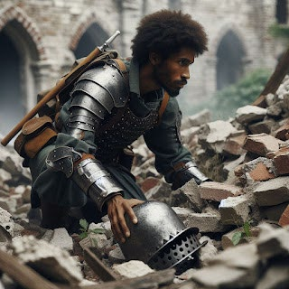
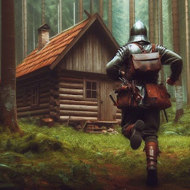

### Alonso A.G

En un valle en la actual Escocia en un tiempo en el que todo estaba
nevado y hacía muchísimo frío allá por la Edad Media, una tropa de
soldados armados y montados en caballos iban camino al reino de
Standton; el reino de Duam-nachit, cuyo rey había estado enfrentado con
el rey Carlos de Standton durante años, decidió mandar una tropa para
destrozar la ciudad.

Era de noche y todo el mundo en Standton estaba dormido. El castillo que
era una enorme construcción llena de soldados y lujos yacía en lo alto
de una colina. El resto de la ciudad donde vivían el resto de población,
estaba amurallada.

Entonces, el jefe de las tropas de Duam-nachit mandó acceder a la ciudad
por el pequeño río que pasaba por allí metiéndose así por los túneles
subterráneos.

Ayudándose de una linterna de fuego, daban su paso por la oscuridad de
los túneles hasta que llegaron al centro de la ciudad, justamente al pie
de la colina; Abrieron la alcantarilla y salieron a la luz de la luna
donde los soldados se agruparon alrededor de la colina para prenderle
fuego.

Después de que montones de pólvora fuese expandida alrededor, le
prendieron fuego a la colina, y por consiguiente, inmovilizando al rey
ya sus tropas que se veían rodeados de llamas.

El pánico no tardó en cesar y la gente salía de sus casas asustadas y
los nobles del castillo no podían hacer nada para pararlo. Enseguida, la
tropa de soldados empezaron a quemar las casas de paja que ardían con
facilidad y a los pobres campesinos se los llevaban atados de pies y
manos.

La gente gritaba y lloraba y los soldados cogían a sus hijos y los
ahogaban en grandes barriles de agua. Por otro lado, el fuego no tardó
en subir por las paredes del castillo y aquello se convirtió en una
hoguera de lo más peligrosa donde el fuego empezaba a penetrar dentro
del castillo.

Los nobles cubriéndose del humo asfixiante intentaban salir por
pasadizos subterráneos que daban a kilómetros de lejanía, y por
consiguiente, fuera de peligro.

Poco a poco, el palacio se calcinaba en llamas y ya no había ni una sola
habitación libre del fuego. Lo peor fue cuando el fuego empezó a quemar
los grandes barrotes de madera que sostenían los techos de las grandes
habitaciones y se rompían dejando que miles de escombros encendidos en
llamas pegaran en el suelo destrozando así las distintas habitaciones
del castillo.

Por los pasadizos iban el rey, su gran visir, algunos de sus criados y
primas de la princesa; Con todo el alboroto, el rey salió a toda prisa
del castillo dejando que los soldados se encargasen de defender lo poco
que quedaba cuando paró en seco y se dio cuenta que su hija la princesa
Helena no estaba con ellos.

-¡Mi hija, mi hija! Debemos de ir a por ella. La había dejado durmiendo
en su alcoba, ¡Nos necesita! - gritaba el rey Carlos desesperado.

A continuación, todos se quedaron perplejos, y enseguida dijo el rey de
nuevo:

-¿Qué hacéis, no me habéis oído? ¡Tenemos que ir a por Helena antes de
que sea muy tarde!

> Entonces los demás se miraron entre sí y dijo la infanta Roberta:

-Lo siento padre, pero volver sería poner en peligro el trono y el
título de reyes de Standton. Tan pronto como lleguemos al final del
pasadizo y lleguemos a una casa, mandaré personalmente que registren en
su búsqueda. Seguro que habrá escapado por su cuenta y nos esté buscando
y ella sabe que en una emergencia siempre salimos por este pasadizo así
que nos encontrará y todo saldrá bien, hermano.

Pero lo que había dicho Roberta no había sido acertado en absoluto y la
pobre Helena seguía debajo de los escombros de su habitación rodeada de
llamas, dejando que poco a poco, el humo la asfixiase. No paraba de
toser y cada vez sentía el fuego más cerca.

De repente desde la torre más alta del castillo llegaron soldados de
Duam-nachit para penetrar en el interior y robar todo en cuanto
pudiesen. Entraron en el castillo por arriba y el fuego no había llegado
allí todavía, pero hacía una calor asfixiante y había un olor horroroso.

-Vallamos rápido, no me quiero calcinar en este castillo del demonio –
dijo el jefe de las tropas con la boca tapada para no respirar humo.

Después de mucho andar llegaron a una habitación donde la calor era más
asfixiante aún y vieron a la princesa Helena rezagada debajo de los
escombros a segundos de morir. Entonces la cogieron y sin buena
intención alguna, se la llevaron.

Los días pasaron y los soldados regresaron a Duam-nachit orgullosos de
comunicarle al rey Antonyo de Duam-nachit, que habían llevado a cabo el
trabajo muy bien y que la preciosa princesa del rey estaba bajo su
poder.

Por otro lado, el palacio de Standton quedó en ascuas y medio
derrumbado, las casas estaban destrozadas, los cultivos de los ganaderos
también y los habitantes huyeron de allí. El sitio parecía una fosa
común con tanta gente muerta por el suelo y los nobles consiguieron
llegar a salvo al final del túnel donde había una casa que pertenecía al
rey Carlos y que pensaban residir en ella hasta que todo se calmase y
encontrasen a la princesa Helena.

Aun así, al rey Antonyo le llevaban los demonios al pensar que el rey
Carlos y su familia había escapado pero aun así, tenía a su preciosa
princesa allí. Antonyo tenía un plan y era matar al rey Carlos y a toda
su familia. Después de eso, la hegemonía pasaría a su hija Helena con
quien casaría y quitaría del medio a los pocos meses, pero se quedaría
con el reino de Standton, un reino conocido por sus grandes fuentes de
oro y minas de joyas.

A la semana del incendio en Standton, Antonyo mandó una tropa buscar
minuciosamente al rey Carlos y a su familia y fusilarlos trayéndole sus
cuerpos y mientras, Helena estaba en los calabozos comiendo la comida
horrorosa que el rey Antonyo le daba y notando como su salud empeoraba a
días por el humo que había inhalado.

Pero al rey Antonyo se le escapaba un detalle: el jefe de las tropas de
Duam-nachit, era de origen Standtanio, y ayudó a los reyes escapar por
los túneles, y tuvo él la maravillosa idea de rescatar a Helena de las
llamas y tenía un plan para traicionar la confianza de Antonyo y salvar
el reino de Standton. Él, el llamado Stuart, estaba en constante riesgo
porque si Antonyo se enteraba de esto, lo ejecutaría, y sería el fin
para el reino de Standton y era algo que podría ocurrir en cualquier
momento porque Antonyo tenía espías por todos lados y en cualquier
momento lo podrían haber visto hablando con Carlos días anteriores del
incendio.

Él era un chico alto, guapo y traído de una familia humilde y deseaba
mandarle una carta a Carlos diciendo que su hija estaba bien y que no
dejaría que le ocurriese nada, pero eso sería demasiado arriesgado.

Un día frío de invierno salieron en busca del rey Carlos y su familia,
como el Antonyo les había dicho, pero Stuart los llevaría por el camino
que no era para así evitar que los demás soldados encontrasen la casa en
la que se alojaba el rey Carlos.

Pero con ellos iban una serie de espías que estuvieron revisando los
informes de los soldados y vieron que el Stuart había nacido en Standton
por

lo que temían que había gato encerrado en todo esto así que sin levantar
sospecha alguna siguieron las indicaciones que le daba Stuart y en el
momento más inesperado, le pegaron en la cabeza con un palo macizo de
madera y lo dejaron inconsciente en el suelo mientras tiraban por otro
camino, y éste era el que llevaba a Carlos y a su familia.

Después de mucho tiempo, Stuart despertó, y al ver lo que había pasado
se fue corriendo hacia la casa donde se alojaba Carlos para asegurarse
que no los habían encontrado pero cuando llegó, los demás soldados ya
estaban allí, tenían sus armas en la mano y tanto el rey como su familia
estaban atados de pies y manos con la boca tapada y tirados en el suelo.

Él llegó inesperadamente y gracias a sus técnicas de lucha empezó a
tumbar a los soldados al suelo, y con la ayuda de su espada dejó a los
espías en el suelo, pero aun así no se daban por vencidos y seguían
luchando hasta que Stuart empezó a sentirse débil y que no podía con
todos, pero aun así, consiguió golpearlos y dejarlos en el suelo por un
rato.

Después desató al rey Carlos y a toda su familia y al rey se le llenaba
la boca de palabras de gratitud hacía Stuart por haberles salvado la
vida. Entonces él les dijo que su hija estaba bien y que haría todo lo
posible para vencer a Antonyo.

De repente, un soldado que estaba medio desangrado en el suelo sacó su
pistola, y sin pensarlo le dio al gatillo antes de morir, con la mala
suerte de darle al rey en el pecho.

El rey Carlos se cayó hacia atrás con los ojos muy abiertos, y Stuart
intentaba parar el sangrado de la herida arrodillado a sus pies. Las
infantas y

las primas de Helena lloraban sin consuelo al ver como el rey de
Standton se desangraba.

Pero era demasiado tarde y el rey apenas podía hablar pero aun así,
reunió todas sus fuerzas para decir:

-Stuart, quiero que salves a mi hija y la traigas a casa y cuides de
ella porque yo no estaré allí y tampoco estaré para ver como Antonyo se
pudre en las catacumbas.

Y con eso, se quedó blanco y frío como la pared y cerró los ojos para
nunca abrirlos.

Stuart lleno de sangre del rey Carlos empezó a llorar y se prometió a si
mismo llevar a cabo el deseo de su majestad, que era traer a su hija de
vuelta.

Su funeral se llevó a cabo en la más miserable de las condiciones y lo
enterraron en una montaña ya que no podían costearse nada más teniendo
en cuenta que acababan de perder su hogar. Lo enterraron con la corona
ya que si alguna vez Helena llegaba a ser reina, se haría una corona
nueva que simbolizara una nueva era en el que Standton había resucitado
de las llamas y donde a Antonyo se lo comían los gusanos.

Pocos días después Stuart regresó palacio donde pretendía seguir con su
plan.

-Dije explícitamente que me trajesen sus cuerpos. ¿Dónde están? -
preguntaba Antonyo al regresar Stuart.

\- Verá, su majestad: nos vieron venir desde la lejanía y decidieron
darse a la fuga así que los perseguimos hasta acorralarlos por las
cataratas, donde se tiraron. Sus cuerpos se los llevaron la riada y sepa
dios donde estén pero no hay posibilidades de que con semejante altura,
el rey haya sobrevivido. Es más, no sé si estoy en lo cierto pero vi
como se daba con algo mientras caía, y luego pude ver algunos destellos
de un rojizo por las aguas cristalinas del río así que supongo que se
daría en la cabeza con una piedra y que, bueno, ha muerto. Aun así,
usted tiene la libertad de casarse con su hija y por consgiuiente
hacerse con el trono, señor. - mentía Stuart arrodillado ante él.

-Está bien. Casaré con ella en cuanto pueda, supongo que debo
felicitarle por su gran trabajo.

La cosa era que aquel soldado que había matado al rey había hecho trizas
el plan de Stuart para salvar el reinado ya que el pensaba en fingir que
había muerto, para que Antonyo casara con Helena, pero no podría
conseguir el trono ya que en realidad Carlos seguía vivo y así poder
imputar a Antonyo pena de ejecución por intentar conseguir un trono que
no estaba en sus manos, pero eso ya no sirve porque Carlos está muerto.

Unas noches previas a la boda de Antonyo y Helena cuando ella aun no
sabía que se iba a casar, Stuart fue al calabozo para comentarle las
novedades:

-Stuart, Stuart, ¡qué suerte que estés aquí! Por favor dime que todo
está bien. - decía Helena con una sonrisa de oreja a oreja al verlo por
allí. Helena era una chica joven, morena y con la piel pálida y era
hermosa.

-Hola, princesa Helena. Me temo que debo contarle algo muy duro para
todos. Su padre ha fallecido bajo la culpa de un indeseable malnacido.
De verdad que lo siento.

-¿Qué? ¿Cómo que ha fallecido? - decía Helena llorando. Entonces se
cogió a las barras de la celda y le preguntó: -Entonces, ¿Qué me va a
ocurrir?

-Me temo que contraerás matrimonio con ese malhechor pero ten por seguro
que le haremos pagar por todos sus malos actos. No te preocupes.

El día de la boda se aproximaba y Antonyo se ocupó personalmente de
comentarle la novedad de su boda que ella ya sabía. Entonces, la
acomodaron en una alcoba y la encerraron allí. Aunque ella se pasase el
día llorando, pataleando y diciendo que ni borracha se casaría con
Antonyo, él tenía por seguro que acabaría cediendo y sino la obligaría.

El gran día estaba a punto de llegar, y Helena se estaba cepillando el
pelo para acostarse ya que al siguiente día iría al matadero. Entonces
alguien tocó a la puerta y apareció por ella Stuart, que muy
sigilosamente iba a verla por las noches cuando Antonyo dormía en su
alcoba a la otra ala del palacio.

-¡Qué alegría que estés aquí! - dijo Helena mientras se levantaba y se
abrazaba a él.

> -Te veo todas las noches.

-Sí pero durante el día, se me hace eterno estar aquí sola y sé que es
demasiado arriesgado venir a verme durante el día, pero…

> -No te preocupes, pronto saldremos de este lugar.
>
> -¿Y quieres decirme ya qué plan tienes?

-Me temo que no te lo puedo decir – dijo Stuart con una carcajada.

-No me importa, solo quiero salir de aquí, y cuanto antes mejor. Mañana
es mi boda y como no acabemos con la vida de este malnacido, voy a ser
esposa durante toda mi vida. Aun estando él muerto, me conocerán como la
viuda de Duam-nachit y yo no quiero eso.

Entonces se miraron los dos a los ojos, se cogieron de las manos, y se
besaron inesperadamente sin previo aviso; Apartaron la mirada, y
volvieron ha hacerlo sin pensar en nada más y dejándose llevar por sus
impulsos.

Enseguida Helena sintió como si a su corazón le creciesen alas y
despegasen hasta lo más alto, paró de pesarle y le dijo:

-Por favor quita del medio a ese malhechor porque yo no podría estar
casada pensando en los besos que tú me das. Hazlo por mí.

\- Haré todo lo que puede para no defraudarte. Y mientras tanto, quédate
con la memoria de mis besos que te ayudarán a sobrellevar el trance de
mañana.

Y con eso Stuart se marchó y aquella noche ambos pensaron el uno del
otro y no conseguían conciliar el sueño por mucho que lo intentasen y a
Helena se le quedaron tallados esos besos para siempre en la mente y
sobre todo, en el corazón.

El gran día llegó y allí estaba Helena, en su habitación vistiéndose
para la boda; Enseguida llegaron unos soldados, la esposaron y se la
llevaron al templo para llevar a cabo la ceremonia. No había nadie más
que ellos y el sacerdote. Arriba en una de las ventanas del templo
estaba Stuart decidido a hacer lo que fuese.

Aunque Helena hubiese dicho que no se quería casar con Antonyo en frente
del sacerdote, parecía que ella no tenía ni voz ni voto en todo aquello
y aun así acabó como la mujer de Antonyo y éste era diez años mayor.

Aquella noche Antonyo mandó que la llevasen a su habitación y así
hicieron y gracias a dios porque Helena temía que al rey le diese por
acostarse con ella.

En su alcoba lloraba y lloraba dejando que sus lágrimas mancharan el
vestido de novias. De repente, alguien entró en la habitación y se sentó
al lado de ella en el suelo.

-Ya sabes que me da tanta alegría verte, Stuart. Gracias por venir.

-Te amo con todo mi ser y saber que estás sufriendo me descuartiza por
dentro.

-Es bueno saber que una es capaz de producir esa sensación en alguien
pero espero que no se la produzca vil de Antonyo.

Enseguida se besaron sin poder evitarlo, pero alguien los estaba
espiando ya que al entrar en la alcoba, Stuart había dejado la puerta
entornada, y se veía lo que hacían por la fina raja además de lo que
decían.

Y es que éste tipo estuvo detrás de la puerta toda la noche y Stuart no
salía así que sepa dios lo que harían allí dentro y pensaba contárselo a
su majestad el rey Antonyo de Duam-nachit.

Al siguiente día, cuando Helena aun no había bajado a desayunar, Antonyo
estaba jugando al ajedrez consigo mismo y de repente entró una figura
oscura que dijo arrodillándose:

\- Su majestad, tengo algo que decirle y me temo que no le va a gustar.

-Desembucha porque sino no sé por qué te pago para vigilar la habitación
de Helena si no me dices lo que le ocurre.

-Se trata de infidelidad, señor. Anoche hubo un mozo que entró en su
habitación y la estuvo besando por un buen rato por no decir que no
salió de allí en toda la noche.

Aquellas palabras hicieron que al rey se le quedara la mirada puesta en
su reina, quien en la vida real se suponía que era Helena.

-¿Se sabe de quién se trata? - preguntó Antonyo dando un golpe al
tablero furioso.

\- No señor, aun no, pero no sé por qué tengo el presentimiento de que
es el capitán Stuart de Altarcín, su majestad. Parece ser que nació en
Standton o al menos eso leí en sus informes. No sé si le ha llegado la
noticia de que han encontrado el cuerpo sin vida de los soldados y
espías que acompañaron a ese tal Stuart a matar al rey y me parecé que
sabían algo, pero este Stuart ha estado evitando que se sepa la verdad.
Aun así, no quisiera acusar a nadie sin pruebas.

-Aunque no sea él quien se esté encamando con Helena, lo quiero muerto
porque es de Standton y todo aquel que pertenezca a ese maldito reino
debe sufrir y por consiguiente morir. Es una pena porque la verdad es
que me hacía el apaño y desempeñaba bastante bien su trabajo pero qué le
vamos ha hacer. A mi preciosa Helena también va a tener un castigo, uno
que le cueste la vida ya que no la necesito. Tenía planeado deshacerme
de ella más adelante pero, visto lo visto, ya ya tengo el reino de
Stadton y Helena es un estorbo. Esta tarde mismo mandaré condenar a los
dos. Mientras, haga el favor de retenerla en su alcoba. - dijo el rey
fríamente.

Aquella misma tarde, a Helena la ataron de pies y manos y se la llevaron
con un saco en la cabeza, mientras ella gritaba desesperada porque no
entendía lo que estaba sucediendo. Al oir sus gritos, Stuart que no
estaba muy lejos, vino corriendo a intentar salvarla, pero le pegaron en
la cabeza con un jarrón y también se lo llevaron atado de pies y manos.

-Tú también te vienes con nosotros – decía un soldado mientras le pegaba
en la cabeza con el jarrón dejándolo inconsciente en el suelo.

> \*\*\*

Las horas pasaron y Stuart despertó atado a un árbol en mitad del monte.
Alrededor suya había un grupo de soldados hablando entre sí y cuando
vieron que se despertaba le dijeron:

-Mira quién despierta, el que tiene el cuajo de encamarse con la esposa
del rey. Hay que tener agallas, ¿eh? Mira, si sigues durmiendo no pasa
nada. Es más, dormirás para siempre.

> Enseguida, Stuart alarmado gritó:
>
> -¡Qué demonios me estáis haciendo! ¡Dónde está Helena!

-Está con su marido, él le va a cantar las cuarenta con mucha sangre y
una pistola que está bien cargada y que dispara con mucho atino.

> -¡Malnacidos, dejadme ir!
>
> -No,no…

A continuación un soldado cogió la punta de la cuerda que ataba a Stuart
al árbol, la impregnó de un líquido inflamable y la echó a arder dejando
que a la vez que la punta de la cuerda se calcinaba, parte del tronco
del árbol también hasta que pronto el fuego estaba subiendo por las
ramas y empezaba a quemar más cuerda.

-Pronto la cuerda se quemará por completo dejándote una barriga
calcinada y unas ganas de gritar locas.

Pero Stuart no reparaba mucho en lo que decía el soldado que seguía
órdenes del rey, e intentaba cortar la cuerda con una uña enorme de
hierro que se ponía sobre el dedo pulgar y que estaba muy afilada.
Cuando por fin consiguió cortar la cuerda, solo necesitaría estirarla un
poco para librarse de allí pero los demás soldados apuntaban con sus
ballestas por lo que no iba a ser fácil escapar.

Cuando sentía que el fuego le recorría la barriga y le quemaba como mil
demonios, el soldado se acercó a él y le dijo:

\- Siento tener que quitarte el lugar en las fuerzas armadas, pero
cuando yo sea el capitán, tú estarás criando malvas en lo más profundo
de la tierra.

Aquel comentario le dio a Stuart como una cuchillada en la espalda, y
cada vez que sentía el fuego más cerca, sentía como poco a poco gotas de
sudor le caían de la cara del calor que hacía atado al árbol; Así que
sin más demora y aprovechando que tenía a aquel soldado en frente suya,
desató la cuerda ante los ojos atónitos de los demás soldados y la
enredó en cuestión de segundos a aquel soldado en la cabeza dejando que
gritase por el dolor que sentía con el fuego en los ojos.

Los demás soldados empezaron a tirar aros con sus ballestas, pero como
era de esperar, Stuart las esquivó todas sobradamente teniendo en cuenta
que había sido capitán durante muchos años y había tenido una
preparación militar impecable.

Poco a poco fue ganando territorio utilizando al soldado en llamas como
escudo, y consiguió salir de allí corriendo lo más rápido que podía.

Tan mala suerte corrió que un aro perdido le dio entre los árboles del
bosque en la pierna, lo que hizo que se cayera al suelo atravesándole la
pierna.

Pero no tenía tiempo que perder ya que Helena lo necesitaba más que
nunca así que siguió corriendo a pesar de que tuviese un dolor horroroso
en la pierna que apenas lo dejaba mantenerse de pie. Pero su corazón
latía con fuerzas y eso le hacía tener la capacidad de levantarse y
correr a pesar de su herida.

Entró al castillo y sin encontrar a Antonyo por ningún lado, escuchó un
grito que lo pudo reconocer a la perfección. Era sin duda de Helena y
sabía perfectamente de donde procedía ya que él se sabía el castillo
mejor que el propio rey.

Tiró la puerta de madera que era sorprendentemente débil con el mangual
de oro que encontró decorando una estatua, haciendo que trozos de madera
saliesen disparados.

Era una habitación redonda con grandes ventanas y Helena se encontraba
arriba del todo en el techo metida en una jaula de hierro que estaba
colgada con una cadena.

A muchísimos metros de profundidad se veía una luz tan brillante que
cegaba y que desprendía una calor abrumadora. Era nada más y nada menos

que una gran masa de magma fundido que chisporroteaba por todos lados y
que provenía del volcán que se encontraba a algunos kilómetros de
Duam-nachit.

> -¡Ayuda! - gritaba Helena al ver a Stuart.

Antonyo que también estaba allí se llevó un disgusto al ver a Stuart
entrar por la puerta ya que no significaría nada bueno.

> Así que cogió dos rifles, los cargó y apuntando le dijo:

-¡Frena! No des un paso más que te fusilo. Aunque parezca que no tengo
experiencia en armas, soy muy ducho en estas cosas.

Sin pensarlo ni una vez, Stuart dijo mientras se abalanzaba sobre
Antonyo:

> -¡Veremos a ver!

A Antonyo no le dio tiempo a darle al gatillo y una pistola se le cayó
de la mano cayendo en el magma, pero la otra la sostenía bien alta y
justo cuando iba a darle al gatillo, Stuart se sacó el arco de la pierna
importándole bien poco el dolor que acababa de sentir al sacarla y se la
hincó al rey en el cuello mientras lo tiraba por la baranda.

> Antonyo gritaba como un descosido y justo cuando Stuart pensaba que se
> calcinaría en el magma, se agarró a la parte de abajo de la baranda.
> Aun así, los brazos cada vez le sujetaban menos colgados en la baranda
> por lo que con la pistola le dio con una manivela que había en la
> pared más arriba, y gritó:
>
> -Tal vez caiga y me calcine, pero que en cinco minutos, una bomba
> estallará en esta sala haciendo que el magma suba y todo acabe
> calcinado. Además, saldrá todo el magma del volcán que se moverá por
> kilómetros y kilómetros y acabará con toda Escocia.
>
> Sin pensarlo ni un solo segundo, Stuart fue a todo correr hacia
> Helena, la sacó de allí y salieron de la sala lo antes que pudieron
> corriendo por los pasillos del castillo.
>
> -Antes de nada, Stuart, quisiera decirte que muchísimas gracias por
> salvarme y por estar ahí cuando más lo necesitaba – decía Helena
> mientras que se paraba y lo miraba a los ojos.

-Muy bien pero todo esto va a explotar en unos minutos y no tenemos
tiempo.

-No, escúchame. No me importa acabar calcinada. Pero quiero que sepas
que te quiero con toda mi alma y si nos salvamos de ésta, quiero estar
frente al altar contigo y reinar el reino de Standton contigo como rey.

Y con eso, los dos se miraron a la cara tan fijamente que se podían leer
la mirada y sin poder evitarlo se besaron importándoles bien poco la
bomba.

De repente, se escuchó un enorme ruido y todo empezó a moverse como si
fuera un terremoto cuando la torre más alta del castillo explotó en
añicos cayendo sobre el resto del castillo y rompiendo muchos techos.

En menos que canta un gallo el castillo se estaba desmoronando ladrillo
por ladrillo y todo el personal de sirvientes salían corriendo de allí,
al igual que Stuart y Helena.

Pero cuando se habían montado en un caballo rumbo a Standton, todo
aquello explotó en llamas y poco después el magma empezó a salir de allí
como una fuente de agua.

El caballo se calló al suelo pero por suerte, Stuart y Helena
consiguieron escapar por el bosque sanos y salvos corriendo cogidos de
la mano.

Aquello acabó como la mayor tragedia del mundo, y años después cuando
todo había acabado y el castillo de Standton se había restaurado, se
proclamó la boda de Helena y Stuart que concluyó con una coronación que
declaró a doña Helena de Standton, reina.

Todo acabó tan bien que incluso pudieron ir a visitar la tumba de Carlos
con el hijo de dos años de Helena y Stuart, que según las malas lenguas
lo habían tenido fuera del matrimonio, pero eso no importaba sino lo que
de verdad importaba era que Helena se casó con quien ella quería, y se
hizo la paz en Escocia y los efectos del volcán no fueron ni la mitad de
malos de como lo había descrito Antonyo.

Las malas lenguas también decían que el alma de Antonyo seguía por esos
mundos esperando el momento en el que buscar la venganza, y no era así.
No era el alma de Antonyo quien esperaba el momento para zarpar sino el
propio Antonyo en carne y hueso que consiguió escapar, calcinado pero
escapó y con prótesis en el noventa porciento del cuerpo esperaba detrás
de un árbol y observaba como Carlos, el hijo de Helena y Stuart jugaba
solo por el bosque hasta que un día, sacó la pistola que tanto deseaba
sacar y apuntó.

